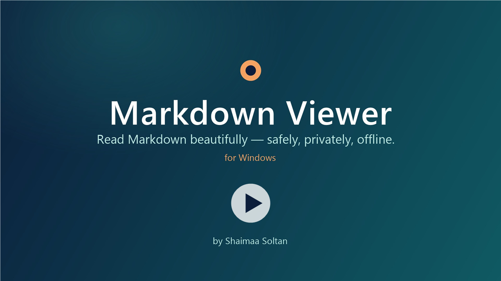

# Markdown Viewer (WebView2)

A preview-only Markdown viewer for Windows. Double-click a `.md` file and it opens in the app's own
window with figures, math, code colouring and diagrams — and the app never runs code from a document
and never goes online. It also shows CSV/TSV tables, JSON, Excel workbooks, XML, Jupyter notebooks, source
code, config files and logs the same way: as data and text, never run.

[](docs/promo.mp4)

▶ **[Watch the one-minute promo video](docs/promo.mp4)** (MP4, 1080p, no sound)

## Features

- **Markdown rendering** with [marked](https://github.com/markedjs/marked), including tables, task lists and inline HTML (sanitised)
- **Math** with [KaTeX](https://katex.org) (`$…$`, `$$…$$`, ```` ```math ````)
- **Code colouring** with [highlight.js](https://highlightjs.org)
- **Diagrams** with [Mermaid](https://mermaid.js.org) (```` ```mermaid ````)
- **Folder sidebar** with every file the viewer shows next to the opened one (each with a type icon; **☰ Types** chooses which kinds the list shows - Markdown, tables, JSON, Excel, XML, notebooks, source code, config, text - with how many of each, remembered), a table of contents, and a picture/diagram viewer
- **Images list** (🖼️ Images, Ctrl+Shift+G): every picture in the document as a thumbnail; click to go to it, double-click to enlarge, and step through them in the viewer with ‹ › or the arrow keys
- **Links list** (🔗 Links, Ctrl+Shift+L): every link with its text and real address (web, e-mail, other Markdown files, sections, disabled files); links flagged by the safety check are marked ⚠. Clicking an entry goes to the link in the document without opening it; ⧉ copies the address
- **Counts**: lines, characters, words, sentences, paragraphs, reading time, images, links, tables, code blocks, equations
- **Breakdown** that reconciles the source file with what is shown, and a **Characters** inspector (encoding, escapes, zero-width and hidden characters, leftover placeholders)
- **Safety check**: a ✓ Safe / ⚠ / ✗ Unsafe badge for every document, with a report of tricks aimed at you, at AI assistants or at other apps. It looks for scripts and active content, links whose text shows another address, look-alike addresses and letters, links to programs, network-share links, tracking pixels, hidden text and copy-paste traps, hidden instructions for AI tools, commands that download and run code, and Trojan Source text-direction tricks
- **¶ Hidden** highlighting, **Find & Replace**, **Export** (save or copy without hidden characters), **Save as PDF**
- **Auto-reload**: when another program saves the open file, the new version is shown at the same place (unsaved replacements are never thrown away)
- **Back / Forward** (← → buttons, Alt+← / Alt+→, mouse side buttons) between documents reached through links or the file list
- **Source view** (`</> Source`, Ctrl+Shift+U): the Markdown with line numbers beside the document, scrolling together; invisible characters show as markers, and the line numbers in the safety report open it there
- **Right-to-left text**: Arabic, Hebrew and other paragraphs, lists, headings and tables follow their own direction; code and math stay left to right
- **GitHub-style callouts**: `> [!NOTE]`, `[!TIP]`, `[!IMPORTANT]`, `[!WARNING]`, `[!CAUTION]`
- **Copy buttons** on code blocks, and **click an equation to copy its LaTeX**
- **Broken links**: links to missing files or sections are underlined and marked in the Links list
- **Diagram export**: save a Mermaid diagram as SVG or PNG from the figure viewer
- **Save as web page**: one self-contained .html file with pictures, math fonts and diagrams embedded, and no scripts
- **Save as PDF** with a contents page, the file name at the top and page numbers ("2 / 5") at the bottom of every page
- **Video and audio**: `` (as on GitHub) or `<video src="clip.mp4" controls>` plays in the page; .mp4, .webm, .mp3, .wav, .ogg. Videos are read a few MB at a time as they play, so any size works and seeking is instant
- **Open pictures, video and audio directly**: right-click a file › Open with › Markdown Viewer (WebView2) shows it on its own page (the installer adds it to Open with only, never as the default app)
- **Open other files with the viewer**: tables, JSON, Excel, XML, notebooks, text, logs and config files are offered under right-click › Open with › Choose another app. They are not added to those types' own Open with lists, so Windows never starts asking how to open them. Files that Windows or other programs run (`.cmd`, `.bat`, `.ps1`, `.js`, `.py`, `.html`…) are not registered at all, so a double-click still runs or opens them as before; the viewer shows them from its file list, a link or a drop. Opening a file whose kind is hidden in ☰ Types shows that kind again.
- **CSV and TSV tables**: a `.csv` or `.tsv` file (opened with right-click › Open with › Choose another app, from a link in a document, from the file list or by dropping it) is shown as a table: click a column to sort it (numbers as numbers), filter all columns at once (hidden ones too: a hidden column where the text is found is shown again) or each column on its own (text anywhere in the cell, or `>100`, `<=5`, `=Toronto`, `!=0`…), choose which columns to show (☰ Columns: tick or untick each, find a column by name, Show all / Hide all; the count shows how many of all columns are shown), and copy or save the rows the filters keep - only the shown columns - in the shown order. The separator (comma, semicolon, tab, `|`) is detected; quoted cells may hold commas and line breaks. Every cell is plain text - nothing in a table can become a link, a picture or code. Large files stay quick: 500 rows are drawn at a time.
- **JSON files**: `.json`, and `.jsonl` / `.ndjson` (one JSON value per line), open the same ways as tables and can be shown three ways: **{ } Text** - indented and coloured with line numbers, re-indented from the file's own characters so every number and string stays exactly as written (a 20-digit id is not rounded); **🌳 Tree** - objects and arrays you open and close, with item counts, Expand all / Collapse all, 500 items drawn at a time; **▦ Table** - one of its arrays (chosen from a list such as `$.items (120 items)`, or the top object's keys and values), each element a row and nested fields as columns like `stock.store`, with the same sorting, filters, ☰ Columns, Copy and Save CSV as CSV files. Text that is not valid JSON is shown as it is, with the line and column where it breaks. Every key and value is plain text - nothing in a JSON file can become a link, a picture or code.
- **Source code, config, text and logs**: `.ps1`, `.py`, `.js`, `.ts`, `.cs`, `.java`, `.sql`, `.sh`, `.bat`/`.cmd`, `.c`/`.cpp`, `.go`, `.rs`, `.css`, `.html` and more, `.yaml`, `.toml`, `.ini`, `.env`…, `.txt`, `.log`: coloured (highlight.js, plus the viewer's own grammars for PowerShell and batch files: cmdlets, `$variables`, `[types]`, `%variables%`, labels, strings and comments each in their colour, and parameters - PowerShell `-Path`, batch `/s` - in a teal of their own) with line numbers beside each line and **Wrap long lines**; shown only, never run - a safe way to read a script before running it. HTML is shown as its source, never as a page. Hidden and text-direction characters are marked, so "Trojan Source" tricks stay visible.
- **XML**: `.xml`, `.xsd`, `.xslt`, `.config`, `.csproj`, `.resx`…: **Text** (coloured), **Tree** (elements with attributes and child counts, opened and closed) and **Table** (repeated elements such as `/catalog/book` as rows: attributes as `@name`, child text as columns), with the same table tools as CSV. Read with the browser's XML parser, without the file's DOCTYPE: entities (`&name;`) are shown as written, never expanded, and nothing in the file is loaded or run. XML that other programs would act on - external entities (XXE), an external DTD, an entity bomb, XInclude, XSLT - is flagged red ("⚠ Unsafe XML", a popup and a "✗ Unsafe" safety report); XML and HTML files have the safety report button like documents. Comments are checked for what they hide: code in a comment, a comment that a browser ends earlier than XML does, conditional comments (`<!--[if IE]>`) and harmful commands are flagged. An XML or HTML file holding code (script elements, `on…` handlers, `javascript:` links) gets the same ⚠ warning as a document - here it is only text, but a browser or another program could run it.
- **Excel workbooks** (`.xlsx`): pick a sheet and it is shown with the CSV table tools (sort, filters, ☰ Columns, Copy, Save CSV). Values as last saved by Excel, dates as dates; formulas and macros are never run. The file is unpacked by the browser itself with size limits (a "zip bomb" stops at the limit).
- **Jupyter notebooks** (`.ipynb`): Markdown cells rendered like documents (cleaned the same way), code cells coloured with their `In [n]` number, outputs as text, pictures and cleaned HTML tables, with **Show outputs** on or off. Code is shown, never run; code in Markdown cells or HTML outputs is removed and reported like in documents.
- **Pictures on / off** (Ctrl+Shift+B, remembered): with pictures off, documents open without loading any picture - each shows its text (or file name) instead; right-click a placeholder › Load picture (or Load all pictures) to show it
- **Picture as text**: "</> Text" in the picture viewer shows the picture file the way Notepad would open it (SVG as its text, PNG/JPG as their bytes)
- **Text size and page width**: A− / A+ (small to largest) and ↔ (normal, wide, full window), remembered; printing keeps its own size
- **Footnotes**: `[^1]` in the text and `[^1]: note` anywhere - numbered in order of use and listed at the end with links both ways, as on GitHub
- **Table tools** for tables in documents: click a column header to sort (numbers sort as numbers; again to reverse, a third time for the original order); ⧉ Copy pastes the table into Excel or Word as cells; ⬇ CSV saves it
- **Compare two versions** (⇄ Compare): this document against another Markdown file from the folder or anywhere on the PC - lines only in one version in red or green, changed words marked inside changed lines, unchanged stretches folded, Previous / Next change, optional "ignore spaces"
- Light / dark / automatic theme; view settings are remembered

## Security

Every point below, with where it is implemented and how it was tested, is listed in
[SECURITY-CHECKLIST.md](SECURITY-CHECKLIST.md).

- **Preview only.** Scripts, event handlers, `javascript:` links, frames, forms and plugins in a document are removed before display and also blocked by the window's Content-Security-Policy. Only the file types listed under Features are read from disk (documents, tables, JSON, Excel, XML, notebooks, source code, config, text, pictures, audio and video), and every text file reaches the page as plain text - never as a web page or a script - so nothing in them can run.
- **No network port.** The page lives at a private address (`https://mdviewer.example`) that exists only inside the app window; every request is answered by the program itself.
- **Never goes online.** All libraries are bundled (`src\lib\`) and packed into the signed Content DLL. The WebView2 engine is started so that it cannot look up any internet address, without background networking, component updates, pings, SmartScreen checks or Microsoft-account sign-in. Pictures a document links to on the web are shown as *not loaded*. (Only the optional `Check-Updates.cmd`, when you run it, asks two fixed sites for version numbers - see [Checking for updates](#checking-for-updates).)
- **Links ask first.** Web and mail links open outside the app only after a question that shows the real address.
- **Private.** The window runs InPrivate, so no history of the documents you view is kept. Camera, microphone, location, notifications and clipboard reading are refused; downloads come only from the viewer itself; the right-click menu has no Share, web capture or other browser extras.
- **Stays in the document's folder.** Folder links (junctions, symbolic links) cannot lead outside it, and very large files (over 50 MB of text, or 200 MB of media or Excel) are not opened. A document cannot draw over the viewer's own controls, and a diagram cannot add CSS of its own.
- **Where a file came from, and Microsoft Defender.** Each file the app opens is checked on this computer: its Mark of the Web (Windows' "downloaded from the internet" tag) shows as "⚠ From the internet: site" in the status line and in the safety report, and Microsoft Defender - asked through AMSI, as Windows does for scripts - is asked about its contents; a file it knows as malware raises a red popup, "✗ Microsoft Defender: malware" and a "Not safe" report. Nothing goes online and the file is only read.
- **Blocked-code alert.** When a file contains code (scripts, event handlers, code links), a popup says so when it opens: nothing ran, and it is a file to be careful with elsewhere. If the window's security policy ever has to stop code itself, that is shown too.
- **No copy-paste traps.** Text inside code examples cannot be hidden or restyled, so what you copy is what you see.
- **Signed, no loose script files.** The page and every library are packed into `MarkdownViewerWebView2.Content.dll`. It and the program are signed with the same Authenticode certificate. At every start the program checks both signatures, plus Microsoft's signature on the WebView2 files, without going online, before any of them is loaded. The WebView2 files must also be exactly the ones the program was built with (their SHA-256 is part of the signed program), so an older or different Microsoft file is refused as well. If any of these files is changed, swapped or missing, the app does not start. See [Signing](#signing).
- **Nothing extra in the program's folder.** Windows looks in a program's folder first for many DLLs, and .NET for its configuration. Anything there that isn't part of the app (a planted DLL, a `.config`, `.manifest` or `.local` file or folder) stops the start; reinstalling removes it. The app is installed in Program Files, so the folder cannot be changed without administrator rights at all - the only full protection, because .NET itself loads a few Windows DLLs (`cryptbase`, `cryptsp`, `profapi`) from a program's folder before the program's first line runs.
- **Checked files stay locked.** From the check until the app closes, the program, the Content DLL and the WebView2 files cannot be changed, replaced, renamed or deleted, and neither can their folder, so what was checked is what gets loaded.
- **Safe DLL loading.** The app turns on Windows' image-load protections at start: system DLLs come from System32 before any copy elsewhere, and never from a network share, a file written by a sandboxed process, the current folder or PATH. The program's own calls into Windows DLLs load them from System32 only. The legacy ways other programs push a DLL into every process - AppInit_DLLs, global window hooks, legacy (non-TSF) input methods and Winsock layered providers - are switched off as well.
- **No crash dumps.** An unexpected error is logged (`%LOCALAPPDATA%\MarkdownViewerWebView2\errors.log`: its type and stack only, never its message, which could quote document text) and the window keeps running; an error on a background thread, which cannot be survived, ends the app right after logging. Either way Windows Error Reporting never receives a memory dump that could hold the open document. Settings are saved through a new temporary file with a random name (which must not exist yet) and an atomic replace, so a crash cannot leave them half written and nothing can place a file there beforehand to redirect the write.
- **One viewer at a time.** Only one copy runs per user and Windows session. Opening another document (a double-click, the Start menu) hands it to the running viewer, which shows it in a window of its own - and each window can read only its own document's folder. The hand-over is a named pipe that only your account can open and never the network can; the viewer accepts a request only from this same program file (after its start-up checks), and the second copy hands its document over only after checking that the other end is this same program, so a look-alike learns nothing. A request is one path to an existing file of a type the viewer shows; requests are rate-limited and windows are capped at 20. If the running viewer cannot be verified, the second copy simply runs on its own.
- **Fresh browser data.** The WebView2 engine starts with a new, empty data folder at every start; folders of ended runs are deleted. Nothing left in that folder by an earlier run or another program is read.
- **No startup hooks.** If environment variables would make .NET load a profiler or an AppDomain manager into the app (`COR_ENABLE_PROFILING`, `COR_PROFILER*`, `APPDOMAIN_MANAGER_*`), it refuses to start. `DOTNET_STARTUP_HOOKS` belongs to .NET Core and is never read by this .NET Framework app.
- **Never as administrator by accident.** Opened with administrator rights (for example from an administrator prompt) while a normal start is possible, the app refuses and asks you to open the file normally. `Install.cmd`, Setup and `Uninstall.exe` refuse to be started as administrator too: they build, sign and register the app as you, and ask for administrator rights only for the copy into Program Files and the firewall rules (Setup) or for removing them (`Uninstall.exe`).
- **Windows entries stay pointed at the installed copy.** At start, an installed copy corrects the entries that open `.md` files, pictures and media when they point to a deleted copy (a place any program running as you could fill with its own program); the Program Files copy also corrects them when they point to any other copy. Development builds and copies run from other folders never touch them, and the installer reads them back and warns if a change did not stick.
- **Genuine engine.** After the WebView2 engine starts, the app checks that it is Microsoft's `msedgewebview2.exe`, signed and under Program Files (which only an administrator can change); otherwise no document is shown.
- **No developer access.** Developer tools are off; the app refuses to show documents if WebView2 remote debugging has been switched on, or if it cannot check.
- **Safe install.** The app is installed in Program Files, where only an administrator can change it, by Setup (also what `Install.cmd` runs). Only the copy step runs with administrator rights: Windows PowerShell from System32 with a short readable command - what the administrator prompt's "Show more details" shows - that runs only the copy step from Setup's bytes after checking their SHA-256, so a swapped Setup never runs and nothing is started elevated from the Downloads folder. It trusts nothing it is handed: it works out the folder itself, checks every file's SHA-256 and signature in a staging folder only administrators can change, and writes nothing into your folders. No script file is installed. All scripts use only Windows PowerShell's own modules (limited with plain text before any command runs) and start PowerShell by full path; neither the build nor the installer runs from an administrator window. See [Install](#install).
- **Firewall rules with every install.** Setup's administrator step adds two Windows Firewall rules that block all traffic in and out of the installed `MarkdownViewerWebView2.exe` (it takes no path from outside, so they can only ever be made for this app); `Uninstall.exe` removes them. They do not cover the WebView2 engine (`msedgewebview2.exe`), which Windows shares with other apps.
- **Check the project folder.** Every `Install.cmd` install records the SHA-256 of every project file (all except `.git\`, `app\dist\` and `app\release\`) in Program Files, next to the program, where only an administrator can change the record. `app\Check-Source.cmd` lists every file changed, added or removed since the last install - also changes made by another program running as you. It runs the project's `app\check-source.ps1` only if that is exactly the copy the record lists (read once, SHA-256 checked, run from those bytes), so a changed checker cannot hide changes; it says so instead. `Install.cmd` runs the same check before it builds: if the folder changed since the last install, it lists the changes and builds only after you answer Y. The new record is taken before the build and compared again after it: if the sources change while building, nothing is installed. Run it before installing an update you did not expect: changes you made or pulled yourself show up too, so only unexplained ones are a warning.

**What this does not cover.** Windows' administrator prompt is not a security boundary against programs
already running as you: they could change this repository's scripts or sources before you run
`Install.cmd`, and Windows would still show its usual prompt. Keep the repository in your own folders, run
`Check-Source.cmd` (and `git status`) before installing if in doubt, and confirm a signing request only while
a build you started is running. A build in `app\dist` is for testing; only the installed copy in Program Files has the full protection.
Signatures carry no timestamp (builds never go online): the signing certificate is valid until October 2036,
after which the app's start-up check refuses the program - install a build signed with a new certificate
before then. `Install.cmd` warns once less than a year is left.

## Requirements

- Windows 10 or 11 (64-bit)
- Microsoft Edge WebView2 Runtime — included with Windows 11
- .NET Framework 4.x — included with Windows; its C# compiler builds the app, nothing else to install
- Administrator rights once per install or update (for the copy into Program Files and the firewall rules) and
  once to uninstall; on a standard account, Windows asks for an administrator's password

## Install

1. Download or clone this repository.
2. Run `app\Install.cmd` (double-click it; not "Run as administrator"). It checks the project folder against
   the last install, builds and signs the app as you, and installs it with the Setup that build made - the
   same steps as on any other PC (see below): one administrator prompt copies it to
   `C:\Program Files\MarkdownViewerWebView2`, where only an administrator can change the program's files (no
   program running as you can replace them or put a DLL or `.config` file next to them), and adds the
   firewall rules that block its network traffic; then Start menu entries, a Settings › Apps entry, the
   `.md` / `.markdown` / `.mdown` / `.mkd` file association and Open with for pictures, video, audio, tables and
   other data files (see Features) are made for your own account.
3. If Windows asks which app to use the next time you open a `.md` file, pick **Markdown Viewer (WebView2)** and click **Always**.

Run `Install.cmd` again to update (one administrator prompt each time). A copy that earlier versions installed
in `%LOCALAPPDATA%\Programs\MarkdownViewerWebView2` is removed. The scripts use only Windows PowerShell's own
modules (never look-alikes from your Documents module folder) and start PowerShell by its full path, so
nothing planted in your account runs with the administrator rights you grant. `Install.cmd` does not run from
an administrator window, and stops with a message if it cannot ask you a question (e.g. in PowerShell ISE).
A new signing certificate or open viewer windows are asked about in a Yes/No box.

### Setup

Every install (and `app\build.ps1`) makes `app\release\MarkdownViewer-Setup-<version>.exe`: one signed file
with the built program inside, for installing on another PC without building - or here, without the console
window. Double-click it (not "Run as administrator"): a window with the logo shows the version, who signed it
and whether the viewer is installed, with **Install** / **Update**, **Uninstall**, **Open the viewer** and
**Close**; progress and questions appear in that window. Setup **installs, registers and adds the firewall
rules**; `Uninstall.exe` does the opposite.

- The files are resources of Setup, listed with their SHA-256 inside it, so Setup's signature covers them all.
  Setup checks its own signature at start (a changed Setup does not run) and keeps its file locked until it ends.
- The copy into Program Files is the only step with administrator rights, and Setup does not run elevated
  itself: Windows asks for **Windows PowerShell**, whose short readable command ("Show more details") reads
  Setup's bytes once, checks them against the SHA-256 Setup took of its checked file and runs only the copy
  step from those bytes in memory - nothing is started from the Downloads folder with administrator rights,
  where a planted DLL could be loaded with it. The copy step works out the Program Files folder itself (not
  from an environment variable), writes into a staging folder there that only administrators can change,
  checks every file's SHA-256, that the program, Content DLL and `Uninstall.exe` are signed by Setup's
  certificate and the WebView2 files by Microsoft, swaps the folders (a copy in use is never left half
  replaced), and adds two Windows Firewall rules that block all traffic in and out of the installed
  `MarkdownViewerWebView2.exe` (it takes no path from outside). It writes no log file.
- An installed copy signed by another certificate is replaced only after you answer Yes.
- Afterwards Setup checks, as you, that Program Files holds exactly the files inside it and that both firewall
  rules are there, then registers the file types, Open with, Start menu and Settings › Apps for your account.
- **No script file is installed.** Program Files holds the program, its Content DLL, the WebView2 files, the
  icon and `Uninstall.exe` - plus the project record `source-manifest.txt` (for `Check-Source.cmd`) when the
  Setup was made by `Install.cmd`, which puts it in Setup. It lists the project's file names and SHA-256 (no
  file contents), so whoever you give that Setup also gets that list. A Setup made by `build.ps1` alone has
  no record; when it updates an install that has one, it keeps it. `trust.ps1` stays
  in the project folder: certificate trust is only for the PC that holds the signing key.
- On another PC the certificate is not in Windows' trusted list, so Windows may show the publisher as unknown;
  the viewer itself only needs its files intact and signed by one certificate. Compare the thumbprint Setup
  shows with yours. The other PC needs the Microsoft Edge WebView2 Runtime (part of Windows 11); Setup says
  if it is missing.

### Uninstall

`Uninstall.exe`, installed next to the program and signed with the same certificate (built from
`app\Setup.cs`), **uninstalls, unregisters and removes the firewall rules**. Start it from Settings › Apps ›
Markdown Viewer (WebView2) › Uninstall (a window with Uninstall, Open the viewer and Close), with
`app\Uninstall.cmd`, or with **Uninstall** in Setup (both without the window: `--uninstall`).

- It acts only as the copy in Program Files (only an administrator can change it) and refuses to run from
  anywhere else, checks its own signature at start, and has the same start-up protections as the viewer.
- It removes only this app's entries (entries that start another copy of the viewer are left alone and
  listed), restores your previous `.md` default, and removes the shortcuts, the Settings › Apps entry, saved
  settings, browser data, the error log, the certificate trust (if you added it) and any per-user copy from
  earlier versions.
- The Program Files folder and the firewall rules go with one administrator prompt - a short readable Windows
  PowerShell command that waits until `Uninstall.exe` has closed (it lives in that folder), then removes the
  folder; a failure shows a message. The signing certificate stays in your certificate store for later builds.

## Build only

```bash
powershell -NoProfile -ExecutionPolicy Bypass -File app\build.ps1
```

Output goes to `app\dist\` (for testing; it is not installed) and the Setup file to `app\release\`. The build checks the compiler's and the
WebView2 files' Microsoft signatures and the WebView2 files' exact SHA-256, that the bundled libraries match
the versions listed in `viewer.js` and that the page loads nothing from the internet. It then packs the page
and libraries into `MarkdownViewerWebView2.Content.dll`, builds `Uninstall.exe` and Setup (`app\Setup.cs`), and signs
the program, that DLL, `Uninstall.exe` and Setup with one certificate (Windows asks you to confirm the signing). Run it
from a normal window: it refuses to build with administrator rights.

## Signing

The program, `MarkdownViewerWebView2.Content.dll`, `Uninstall.exe` and Setup are Authenticode-signed by every build with one certificate. The program checks its own and the Content DLL's signature - plus Microsoft's on the WebView2 files and their exact SHA-256 - at every start (see [Security](#security)).

The first build creates a code-signing certificate on your PC named
"Markdown Viewer" (publisher; builds before 1.10 used "Markdown Viewer (WebView2) Code Signing"). It is stored in your personal certificate store, its private
key cannot be exported, and the key is **protected**: Windows asks you to confirm every time something signs
with it, so no other program running as you can quietly sign a changed program or Content DLL. Later builds
reuse it (you confirm when a build signs). Certificates from earlier versions had no such protection; the build
no longer uses them, and you can delete them in certmgr.msc › Personal › Certificates.

**Only fresh, untouched files are signed.** The build signs just the program, Content DLL, `Uninstall.exe` and Setup it has compiled
moments before. The WebView2 files are never signed by the build: they must carry Microsoft's valid signature
and match the SHA-256 recorded in `build.ps1`, otherwise the build stops before anything is compiled or
signed. The compiler, PowerShell and its modules are used from Windows' own folders by full path, never
looked up on PATH or in your Documents module folder.

**Updates keep the certificate.** Setup (also when `Install.cmd` runs it) only replaces an installed copy with a
build signed by the same certificate. When the certificate has changed (for example right after a new one was
made), it shows both thumbprints and installs only after you answer Yes.

To sign with a certificate bought from a certificate authority instead, run:

```bash
powershell -NoProfile -ExecutionPolicy Bypass -File app\build.ps1 -CertificateThumbprint <thumbprint>
```

Windows doesn't trust a certificate made on your own PC by default. The app's start-up check works either
way. If you also want Windows (file Properties › Digital Signatures) to show the signature as valid, run
`app\Trust-Certificate.cmd`. It adds the certificate to your Trusted Roots only, not to Trusted Publishers
(Office macros and AllSigned PowerShell scripts from those publishers run without asking). It takes the
certificate only from the program installed in Program Files, only if that is signed by your own signing
certificate (the one on this PC with its private key), and adds it straight from memory - no temporary file
that could be swapped.
`Untrust-Certificate.cmd` undoes that, and so does uninstalling the app.

## Checking for updates

```bash
app\Check-Updates.cmd
```

Shows whether a newer stable WebView2 SDK is out on nuget.org, and newer releases of the bundled libraries
(marked, KaTeX, highlight.js, Mermaid) on the npm registry, next to the versions this project builds with -
plus the WebView2 Runtime installed on your PC (which Windows keeps up to date). It only reports: nothing is
downloaded or installed. The viewer itself never goes online; this script does only when you run it - HTTPS
to `api.nuget.org` and `registry.npmjs.org` only, no redirects, a time and size limit on every answer, and
only version numbers are read from them. `Install.cmd` reminds you (without going online) when the last check
found updates, or when it is more than 30 days old.

### Updating the WebView2 SDK and libraries

The SDK files are pinned by SHA-256, so an update is a deliberate step:

1. **WebView2 SDK:** download the `Microsoft.Web.WebView2` package of the new version from nuget.org (a
   `.nupkg` is a zip file). Take `lib\net462\Microsoft.Web.WebView2.Core.dll`,
   `lib\net462\Microsoft.Web.WebView2.WinForms.dll` and `runtimes\win-x64\native\WebView2Loader.dll` and
   replace the three files in `webview2\`. Check that each carries Microsoft's valid signature (file
   Properties › Digital Signatures), then put their SHA-256 (`Get-FileHash`) into `$sdkHashes` in
   `app\build.ps1` and the new version in its comment and in the table below.
2. **Libraries:** double-click `app\Update-Libraries.cmd`. It first shows the plan - for each library the
   new version, the exact download and which files in `src\` it replaces - and asks before downloading
   anything. Then it downloads each package from registry.npmjs.org only (HTTPS, no redirects, size limit),
   checks it against the SHA-512 the registry publishes, takes out only the expected files (never anything
   else, never outside `src\`), checks they really are the new version (as the build does) and only then
   replaces them and updates the version in `viewer.js` and in the table below. A release that lacks an
   expected file (e.g. no ready-made browser file) is left untouched with an explanation. For one library:
   `app\update-libs.ps1 -Library KaTeX` (plan) or add `-Apply`. Undo with `git checkout -- src README.md`.
   A release published less than 7 days ago is held back (a release pushed through a hijacked npm account
   is usually withdrawn within days); add `-AllowNew` to take it anyway. After replacing files it runs the
   viewer test (below) and says "Do not install this" if it fails. A new major version can change how
   documents look - check a few before installing.
3. Run `Install.cmd`. It lists the changed files since the last install and asks for Y; then run
   `Check-Updates.cmd` again.

### Testing the viewer page

Double-click `app\Test-Viewer.cmd` (it changes nothing). It opens every document in `test\` (every type the viewer shows,
up to 4 MB each) in the viewer page, in Microsoft Edge without a window, and fails unless each one is shown,
its breakdown adds up (✓), no element, attribute or address that could run code reaches the page, no payload
in `test\attack.md` ran and all four libraries load. For the tables it also checks that `test\data.csv`
(payload cells, quoted commas and line breaks) is drawn exactly as text and sorts and filters correctly, and
that choosing columns in `test\wide.csv` (40 columns) works; for JSON, that `test\sample.json` is shown as text (with its 20-digit number exact), as a tree and as tables of its arrays, that `test\events.jsonl` becomes a table, and that `test\broken.json` shows where it breaks; for the other types, that code, logs and config keep every line (with the hidden text-direction character in `test\script.ps1` marked, PowerShell in `test\script.ps1` and batch in `test\sample.cmd` coloured word by word, and every line number beside its line), that `test\catalog.xml` works as text, tree and table and raises the "contains code" warning, that the hostile `test\page.html`, `hostile.xml`, `entities.xml`, `entity-bomb.xml` and `comment-trick.xml` stay text (with their code, unsafe XML and risky comments flagged) in every view (nothing runs or loads, entities are shown as written and never expanded, `win.ini` is never read), that `test\book.xlsx` shows its sheets, dates and values, that `test\notebook.ipynb` renders its cells and outputs, and that the file list's ☰ Types filter hides and shows kinds. Add your own documents with
`Test-Viewer.cmd -Folder C:\path\to\folder`. To try a large table, `test\make-million-csv.ps1` writes
`test\million-rows.csv` (1,000,000 rows, about 45 MB; not kept in git). The page
runs from a temporary copy of `src\` (removed afterwards), served on 127.0.0.1 only under a random path, in
a new empty Edge profile that cannot look up any host name.

## Project layout

| Path | Contents |
|---|---|
| `src\viewer.html`, `src\viewer.js` | The viewer page and its logic (packed into the Content DLL at build time) |
| `src\marked.min.js`, `src\lib\` | Bundled libraries (marked, KaTeX, highlight.js, Mermaid) |
| `app\MarkdownViewerWebView2.cs` | The Windows app (C# 5, Windows Forms + WebView2) |
| `app\Content.cs` | Resource-only `MarkdownViewerWebView2.Content.dll` that carries the page and the libraries |
| `app\build.ps1` | Checks, compiles and signs the app into `app\dist\` |
| `app\install.ps1` | `Install.cmd`: checks and records the project folder, builds (`build.ps1`) and installs with the Setup it made |
| `app\Setup.cs` | Built twice by `build.ps1`: Setup (`app\release\MarkdownViewer-Setup-<version>.exe`, the signed program inside one signed file: installs, registers, adds the firewall rules) and `Uninstall.exe` (installed next to the program: the opposite) |
| `app\trust.ps1` | Optional certificate trust for the PC that builds (not installed) |
| `app\check-source.ps1` | Records the project files' SHA-256 at install time (the record goes into Program Files) and compares the folder with it; `Check-Source.cmd` runs it only if it is exactly the recorded copy |
| `app\check-updates.ps1` | Reports newer versions of the WebView2 SDK and the bundled libraries (only when you run it) |
| `app\update-libs.ps1` | Downloads, checks and replaces the bundled libraries in `src\` (plan first; asks before downloading; holds back releases under 7 days old) |
| `app\test-viewer.ps1` | Tests the viewer page with the documents in `test\` (display, breakdown, nothing that could run code) |
| `app\*.cmd` | Double-click launchers: `Install`, `Uninstall`, `Check-Source`, `Check-Updates`, `Update-Libraries`, `Test-Viewer`, `Trust-` / `Untrust-Certificate` |
| `test\` | Test documents (formatting, lists, UTF-16, `attack.md` with harmless payloads, `data.csv` and `wide.csv` tables, `sample.json`, `events.jsonl`, `broken.json`, `catalog.xml`, `book.xlsx`, `notebook.ipynb`, `script.ps1`, `sample.cmd`, `settings.yaml`, `notes.log`, and the hostile `page.html`, `hostile.xml`, `entities.xml`, `entity-bomb.xml`, `comment-trick.xml`), `selftest.js` (which the test adds to its temporary copy of the page), `make-million-csv.ps1` (a large table for trying the viewer) and `make-test-xlsx.ps1` (recreates `book.xlsx`) |
| `webview2\` | Microsoft WebView2 SDK files needed to build the app, with their license |
| `docs\` | Promo video and its poster picture |

## Third-party components

| Component | Version | License |
|---|---|---|
| marked | 18.1.0 | MIT |
| KaTeX | 0.19.0 | MIT |
| highlight.js | 11.12.0 | BSD-3-Clause |
| Mermaid | 12.1.0 | MIT |
| Microsoft WebView2 SDK | 1.0.4258.31 | see `webview2\WebView2-SDK-LICENSE.txt` |

The original viewer was made using GPT-5; this version was extended and tested with Claude Code (Anthropic).
