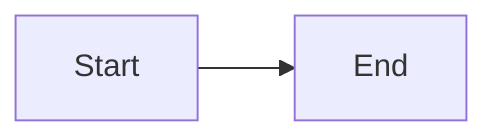

# Preview-only test

Every item below tries to run code. Each one would only set `window.PWN` (a harmless marker);
`Test-Viewer.cmd` fails if any of them got through.

<svg onload="window.PWN = 'svg onload'"><circle r="5"></circle></svg>

s
t

<a href="javascript:window.PWN = 'html link'">html link</a>

[markdown link](javascript:window.PWN='md-link')

[data link](data:text/html,)

<iframe src="javascript:window.PWN = 'iframe'"></iframe>

<object data="javascript:window.PWN = 'object'"></object>

<embed src="javascript:window.PWN = 'embed'">

<form action="javascript:window.PWN = 'form'"><button>go</button></form>

<input type="text" value="not a checkbox" onfocus="window.PWN = 'input'" autofocus>

<meta http-equiv="refresh" content="0;url=javascript:window.PWN='meta'">

<base href="javascript:window.PWN = 'base'//">

<a id="pdfBtn">element named like a viewer control</a>

Math link: $\href{javascript:window.PWN='katex'}{click}$

- [x] a real task box (the only kind of input allowed)
